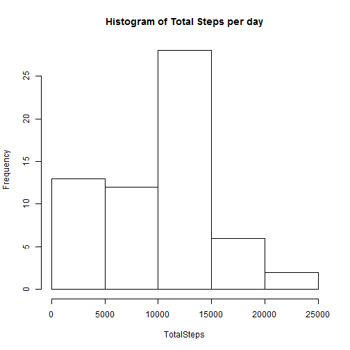
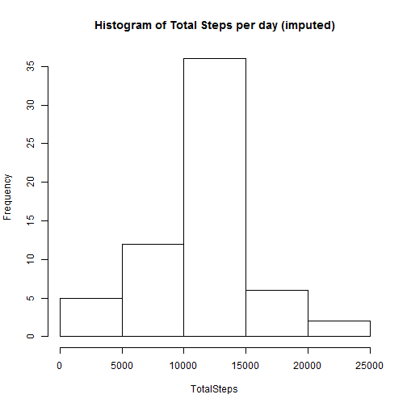
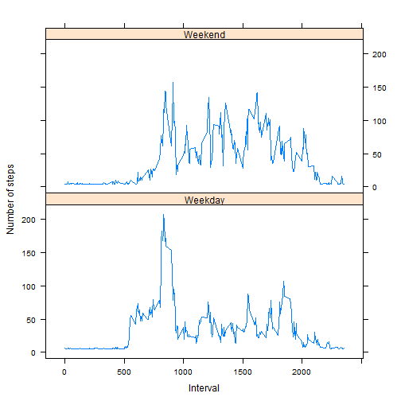

## Loading and preprocessing the data

```r
library(lattice)
data <- read.csv("activity.csv")
```

## What is mean total number of steps taken per day?

```r
daily_data <- with(data, aggregate(x=steps, by=list(date), FUN=sum, na.rm=TRUE))
names(daily_data) <- c("Date", "TotalSteps")
with(daily_data, hist(TotalSteps, main="Histogram of Total Steps per day"))
```

 

```r
mean(daily_data$TotalSteps, na.rm=TRUE)
```

```
## [1] 9354.23
```

```r
median(daily_data$TotalSteps, na.rm=TRUE)
```

```
## [1] 10395
```


## What is the average daily activity pattern?

```r
interval_data <- with(data, aggregate(x=steps, by=list(interval), FUN=mean, na.rm=TRUE))
names(interval_data) <- c("Interval", "AverageSteps")
with(interval_data, plot(Interval, AverageSteps, type="l", ylab="Average Steps", main="Average Steps per Interval"))
```

 

*The 5-minute interval, on average across all the days in the dataset, contains the maximum number of steps:*

```r
interval_data[interval_data$AverageSteps==max(interval_data$AverageSteps), "Interval"]
```

```
## [1] 835
```


## Imputing missing values
*Total number of NAs in the input data set:*

```r
length(data$steps[is.na(data$steps)])
```

```
## [1] 2304
```

*Missing values are replaced by average of 5-minute interval steps across all intervals and all days.*

```r
new_data <- data
new_data$steps[is.na(data$steps)] <- as.integer(mean(data$steps, na.rm=TRUE))
daily_new_data <- with(new_data, aggregate(x=steps, by=list(date), FUN=sum, na.rm=TRUE))
names(daily_new_data) <- c("Date", "TotalSteps")
with(daily_new_data, hist(TotalSteps, main="Histogram of Total Steps per day (imputed)"))
```

 

```r
mean(daily_new_data$TotalSteps, na.rm=TRUE)
```

```
## [1] 10751.74
```

```r
median(daily_new_data$TotalSteps, na.rm=TRUE)
```

```
## [1] 10656
```
**Observation:** *After imputing the missing values, the mean goes up and median moves towards right.*

## Are there differences in activity patterns between weekdays and weekends?

```r
new_data$week <- ifelse(weekdays(as.Date(new_data$date)) %in% 
    c("Monday","Tuesday","Wednesday","Thursday","Friday"), "Weekday", "Weekend")
interval_new_data <- with(new_data, aggregate(x=steps, by=list(interval, week),
    FUN=mean, na.rm=TRUE))
names(interval_new_data) <- c("Interval", "Week", "AverageSteps")
xyplot(AverageSteps ~ Interval | Week, data=interval_new_data, layout=c(1,2), ylab="Number of steps", type="l")
```

 
